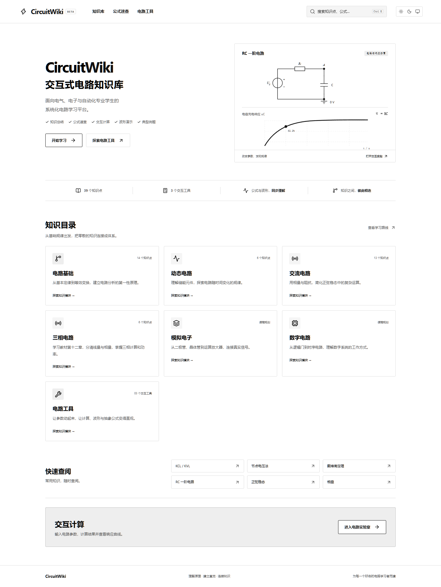

# 电路 · CircuitWiki

vibe coding 的电路网站，教材依据为邱关源《电路》第5版。

面向大学电气、电子、自动化专业学生的交互式电路知识库。把知识总结、公式、电路图、例题、常见错误与交互计算放在同一条学习路径上。

界面默认采用纯白背景、黑色文字和电路图，保留可手动切换的黑白深色模式。按用户提供并确认的邱关源《电路》第5版核对全站基础公式和电源符号，公式旁提供书页与式号；数字代入示例为本站原创。具体范围见 `docs/textbook-review.md`。

## 已实现功能

- 产品首页、7 类知识入口、按教材章、节顺序组织第1—12章的学习路线与常用知识快捷链接；第4章与第7章只学§1至§4，第5章跳过，第11章仅串联与并联谐振。
- 文章目录使用共享布局，切换文章保留滚动位置；刷新和重新打开移动目录也可恢复位置。
- 39 个本地 MDX 学习页面，包含11篇逐节全览及复数、相量图专题；54个范围内教材小节均提供概念、条件、公式、代入示例和易错点。
- 三栏知识布局、当前文章高亮、面包屑、8 节页内目录、上一篇/下一篇和知识互链。移动端可展开目录。
- KaTeX 公式、参数和单位展开、按教材章、节顺序的公式速查，以及关联知识页入口。
- SVG 元件及分压、RC、RL、节点分析、双网孔、戴维南等效电路，以及教材电源符号对照与易错提示。
- 欧姆定律与功率计算、RC 实时响应图、相量双向转换和加减计算，包含空值、数值范围与物理条件校验。
- 本地搜索覆盖标题、知识点关键词、公式名称，支持 Ctrl/Cmd+K 和 Esc。
- Light / Dark / System 主题、持久化、系统主题变化同步、响应式布局、键盘焦点和跳过导航。
- 核心课的交互小测验与即时解释。
- KCL页面的多回路演示可切换元件支路与串联组合计数，并高亮6条回路，区分3个网孔与更大的回路。

- 叠加定理补充功率交叉项与适用情况；戴维南提供开路、短路、输入电阻和测试源两种求解方法。
- 电源等效变换、四类受控源与含源桥臂案例；桥臂参数可实时调整并切换端口状态。
- 正弦瞬时值与波形实验、分步相量画图、Y/Δ三相对照；公式速查包含65条关系，保持教材顺序。

模拟电子、数字电路目前提供独立课程规划页，不冒充已完成课程。无账户、数据库和外部服务密钥。

## 技术栈

安装时通过 npm registry 的稳定标签解析并锁定：Next.js 16.3.8、React 19.3.0、TypeScript 6.0.3、Tailwind CSS 4.3.3、MDX 3.1.1、KaTeX 0.19.0、Recharts 3.10.1、next-themes。App Router 的知识页在构建时静态生成，计算器在客户端运行。

采用本地 `@mdx-js/mdx` 编译器，MDX 通过组件映射调用 UI。**仅编译仓库内可信作者维护的 MDX，不接受用户提交的原始 MDX 执行。** 所有字体和公式资源随应用打包，无远程字体依赖。

## 安装与运行

建议 Node.js 24 LTS，最低 Node.js 22，使用 npm。进入本 README 所在目录：

```bash
npm install
npm run dev
```

访问 http://localhost:3000。生产模式：

```bash
npm run build
npm start
```

有锁文件后，可在 CI 中使用 `npm ci`。无需 `.env`。

### 当前 Codex Windows 工作区

本机已有 Node.js，但 npm 没有加入 PATH。本次开发已在工作区 `work/npm` 准备 npm，依赖也已安装。在项目目录可直接执行：

```powershell
.\Start-CircuitWiki.ps1
# 或指定任务
.\Start-CircuitWiki.ps1 build
```

此脚本优先使用系统 npm，找不到才使用当前工作区的 npm。复制项目到其他机器后，安装标准 Node.js LTS 即可使用上面的普通 npm 命令；无需复制 work 目录。

## 项目目录

```text
CircuitWiki/
├── content/
│   ├── circuits/          # 10 篇电路基础 MDX
│   ├── dynamics/          # 4 篇动态电路 MDX
│   ├── ac/                # 6 篇正弦稳态 MDX
│   └── three-phase/       # 教材第十二章5篇 MDX
├── src/
│   ├── app/
│   │   ├── page.tsx       # 首页
│   │   ├── learn/[slug]/  # 静态知识页面
│   │   ├── curriculum/   # 学习路线
│   │   ├── formulas/     # 公式速查
│   │   ├── tools/        # 三个计算器
│   │   ├── topics/       # 后续课程规划
│   │   └── globals.css   # 主题变量与响应式样式
│   ├── components/
│   │   ├── tools/        # 独立计算器与输入组件
│   │   ├── formula.tsx
│   │   ├── circuit-diagram.tsx
│   │   ├── navigation.tsx
│   │   ├── quiz.tsx
│   │   └── ui.tsx
│   └── lib/
│       ├── chapters.ts   # 教材1—12章与阅读顺序
│       ├── textbook-scope.ts # 54个学习小节与跳过范围
│       ├── additional-content.ts # 逐节全览与专题元数据
│       ├── content.ts    # 导航/搜索/页面元数据
│       ├── formulas.ts   # 公式目录
│       ├── calculations.ts # 无 UI 的计算函数
│       └── mdx.tsx       # MDX 读取与组件映射
├── tests/                # 数值、内容与浏览器测试
├── docs/screenshots/     # 实际运行截图
├── docs/verification.md  # 验收记录和当前限制
├── Start-CircuitWiki.ps1
└── package-lock.json
```

## 截图

`docs/screenshots/` 保存实际浏览器截图：`home-desktop.png`、`home-mobile.png`、`knowledge-desktop.png`、`knowledge-dark.png`、`tools-light.png`、`tools-dark.png`。



服务启动后可重新生成：

```bash
npx playwright install chromium
node tests/capture.mjs
```

Windows 已安装 Edge 时，可设置 `$env:PLAYWRIGHT_CHANNEL='msedge'` 后运行，避免额外下载浏览器。

## 如何新增知识文章

1. 在 `content/circuits`、`content/dynamics`、`content/ac`、`content/reviews` 或 `content/three-phase` 添加对应 slug 的 `.mdx` 文件。
2. 在 `src/lib/content.ts` 的 `articleEntries` 增加元数据，并将 slug 加入 `src/lib/chapters.ts` 对应章的 `slugs`。在同一文件的 `lessonSections` 中设置主教材节号，目录和上一篇/下一篇按章、节排序；同节条目按 slugs 的声明顺序排列；`folder` 必须与文件目录一致。`keywords` 用于搜索，`core` 区分完整课与导读。
3. 保持下面的 8 个二级标题，编号自动映射到 `section-1` 至 `section-8`，供目录定位。
4. 使用 `/learn/slug` 链接，运行测试与构建。无需手动增加页面路由。

```mdx
## 1. 核心概念

简短说明，先说清解决什么问题。

## 2. 前置知识

[KCL 与 KVL](/learn/kcl-kvl)

## 3. 核心公式

<Formula latex={"U=IR"} description="关联参考方向下的线性电阻" />

<InlineFormula latex={"R>0"} />

## 4. 解题步骤

1. 确定方向。
2. 建立方程。

## 5. 电路图

<CircuitDiagram type="divider" caption="电阻分压电路" />

## 6. 典型例题

<Example title="分压练习">

写出题目、思路、计算过程与答案。

</Example>

## 7. 常见错误

<Warning>注意单位换算。</Warning>

## 8. 相关知识

[节点电压法](/learn/nodal-analysis)
```

LaTeX 放入 JavaScript 字符串时反斜杠须转义，例如 `<Formula latex={"\\frac{U}{R}"} />`。不要直接写 `$...$`，本项目明确使用 Formula / InlineFormula 组件。MDX 自定义块组件与 Markdown 段落之间留空行。新增组件需在 `src/lib/mdx.tsx` 注册。

## 如何新增公式

向 `src/lib/formulas.ts` 的 `formulaEntries` 添加 `FormulaEntry`：`name`、`latex`、`position: [章号, 节号, 节内顺序]`、目标文章 `slug`、适用条件 `condition`、含单位的 `parameters`、教材出处 `source`。公式页面按 position 自动排序并按教材章节展示；原创补充例题标记 `supplemental: true`。公式名称也会进入文章搜索索引。

## 如何新增电路图

在 `src/components/circuit-symbols.tsx` 中复用 `Wire`、`Resistor`、`Capacitor`、`Inductor`、`VoltageSource`、`CurrentSource`、`Ground`、`Node`。在 `circuit-diagram.tsx` 增加 `CircuitKind` 类型并组合新拓扑。电源沿用第5版图1-8、图1-10。使用 `viewBox` 与 `currentColor`，不要写死浅色背景；添加 SVG title、图注与参考方向。复杂电路日后可以独立成组件或替换专业绘图库。

## 如何新增工具

1. 将纯计算和输入约束放进 `src/lib/calculations.ts` 或新的专用模块。
2. 在 `src/components/tools/` 创建带 `use client` 的组件，复用 `Field`、`ErrorMessage`、公式和主题变量。
3. 在 `/tools` 引入，设置唯一锚点并增加顶部入口。
4. 添加有物理意义的数值边界测试及主要用户操作的浏览器测试。

当前 RC 模型限定为理想电压源、零初始电压、单电容直流阶跃充电；图表横轴随参数显示 0–5τ 的真实秒数。相量工具的幅值是通用数值，计算时必须使用一致的频率、单位和峰值/有效值约定；文章统一采用有效值相量。

## 检查与测试

```bash
npm run lint
npm run typecheck
npm test
npm run build
# 另一个终端先运行 npm start 或 npm run dev
npx playwright install chromium
npm run test:e2e
```

浏览器测试访问 `http://localhost:3000`，需先启动服务。默认使用 Chromium；本次 Windows 验收使用 Edge Chromium。包括全部路由、MDX、公式、内部链接和页内锚点、搜索、测验、主题持久化、系统主题跟随、三个计算器和 390px 移动端。

`npm run format` 统一格式。TypeScript 开启 strict。计算精度为 JavaScript 双精度，显示约 6 位有效数字，属于教学计算而非专业 SPICE 仿真。

## 部署到 Vercel

1. 将 **CircuitWiki 目录内的项目文件** 提交至 Git 仓库，不提交 node_modules 和 .next。
2. 在 Vercel 导入仓库，Framework Preset 选择 Next.js；若仓库含上级目录，把 Root Directory 设为 `outputs/CircuitWiki`。
3. Node.js 选择 24.x，安装命令 `npm ci`，构建命令 `npm run build`，输出目录保留框架默认值。
4. 不需要环境变量或数据库。部署完成后检查 `/learn/rc-circuit`、`/formulas` 和 `/tools`。

线上地址：[circuit-wiki.vercel.app](https://circuit-wiki.vercel.app)。当前仓库已关联 Vercel，推送 main 分支后自动触发部署。

## 后续开发与已知限制

- 增加更多完整推导、多难度题库、模拟/数字电子课程。
- 当前学习范围内的54个教材小节均有逐节讲解；全览侧重概念、适用条件和数值应用，更多证明与习题可以继续扩展。
- 第4章限§4-1至§4-4；第7章限§7-1至§7-4；第5章跳过；第11章仅§11-2、§11-4。
- 增加非零初始条件、放电与 RL/RLC 响应工具，以及更丰富的电路拓扑。
- 按需添加学习进度本地存储、搜索拼音/模糊匹配、收藏和无障碍审计。
- 当前搜索是本地标题/关键词/公式名匹配，不是文章全文搜索。
- 当前标准路由与浏览器交互未发现阻塞问题；尚未在 Safari / Firefox 和实体手机上验证。
- `npm audit --omit=dev` 为 0 漏洞。完整审计提示 5 个 high 记录，来自开发期 `eslint-config-next → fast-glob → micromatch → braces` 同一依赖链；当前 braces 稳定版 3.0.3 尚无修复版。没有使用 `audit fix --force` 降级 Next lint 配置。此依赖不进入生产运行包；后续升级需继续关注上游修复。

安装方式参考 [Next.js 官方文档](https://nextjs.org/docs/app/getting-started/installation) 与 [Tailwind CSS Next.js 指南](https://tailwindcss.com/docs/installation/framework-guides/nextjs)。
